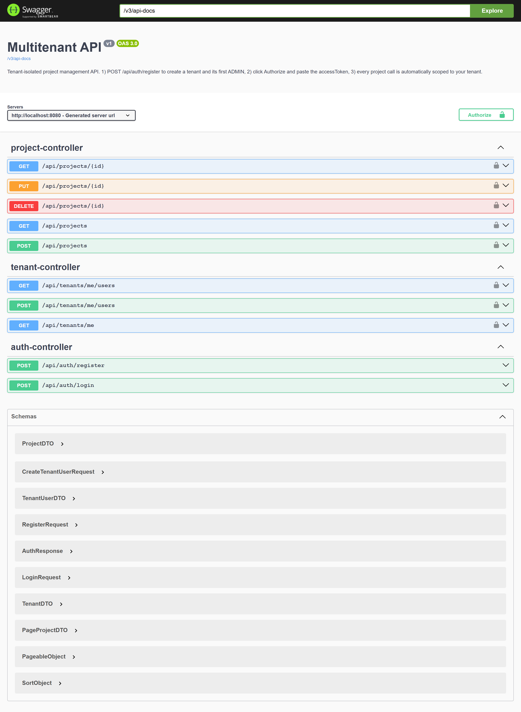
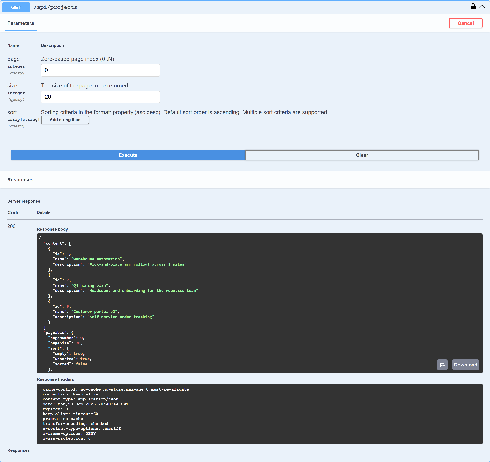
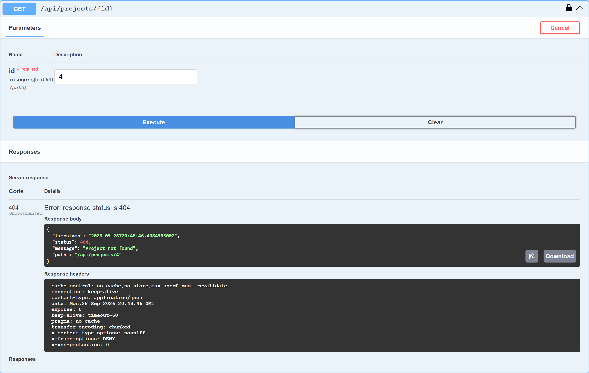
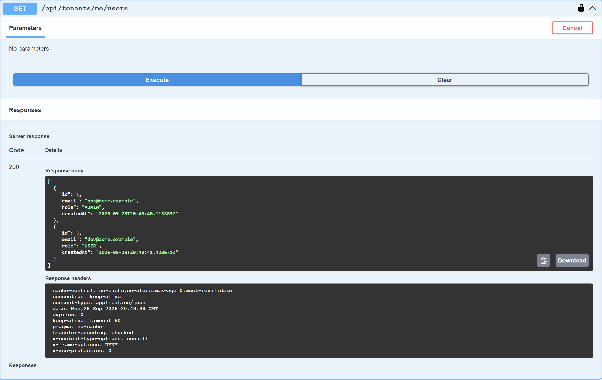

# Multitenant API

A production-minded Spring Boot REST API for tenant-isolated project management.
Each authenticated request is resolved to a tenant through JWT claims, and all
project operations are scoped to that tenant automatically.



## Why this project

This project demonstrates practical multi-tenant backend patterns:

- Self-service tenant sign-up with role-based membership management
- Tenant-aware authentication and authorization (JWT + method security)
- Strong API boundaries that prevent cross-tenant data access, covered by integration tests
- Per-tenant and per-IP rate limiting
- Consistent JSON errors for every failure path (400/401/403/404/409/429/500)
- OpenAPI/Swagger-first developer experience

## Tech stack

| Area | Choice |
|------|--------|
| Runtime | Java 17, Spring Boot 3.3.x |
| Security | Spring Security, JWT (JJWT), BCrypt, `@PreAuthorize` |
| Data | Spring Data JPA, Hibernate, PostgreSQL (H2 for tests) |
| API docs | SpringDoc OpenAPI 3 (Swagger UI) |
| Rate limiting | Bucket4j (per tenant for API traffic, per client IP for `/api/auth/**`) |
| Build | Maven |

## Core features

### Authentication and tenants

- `POST /api/auth/register` creates a **new tenant** and makes the caller its first `ADMIN`, returning a JWT.
  Registration never joins an existing tenant; extra fields such as `tenantId` or `role` are ignored.
- `POST /api/auth/login` returns a JWT for an existing user.
- `GET /api/tenants/me` returns the caller's tenant.
- `GET /api/tenants/me/users` and `POST /api/tenants/me/users` (**ADMIN only**) list and add members of the caller's tenant.

### Tenant-scoped project management

- `GET /api/projects` (paginated: `page`, `size`, `sort=name,asc`)
- `GET /api/projects/{id}`
- `POST /api/projects`
- `PUT /api/projects/{id}`
- `DELETE /api/projects/{id}`

Tenant identity always comes from the JWT, never from the URL or request body. Requesting
another tenant's project id returns `404`, so the API does not reveal that the project exists.

### Error handling

Every error, including those raised in security filters before Spring MVC runs, returns the same `ApiError` shape:

```json
{ "timestamp": "2026-09-28T20:45:10Z", "status": 404, "message": "Project not found", "path": "/api/projects/4" }
```

| Situation | Status |
|---|---|
| Validation failure, malformed JSON, unknown sort field | 400 |
| Missing/invalid token, wrong password | 401 |
| Non-admin calling an admin endpoint | 403 |
| Resource not found or owned by another tenant | 404 |
| Duplicate data | 409 |
| Rate limit exceeded | 429 |
| Unexpected error (details are logged server-side, never returned) | 500 |

## Screenshots

| Tenant-scoped project list | Cross-tenant access blocked |
|---|---|
|  |  |



## Domain model

- `Tenant`: tenant account boundary (name, plan)
- `User`: email, password hash, and role (`ADMIN` / `USER`), linked to a tenant
- `Project`: tenant-owned project entity
- `Task`: schema included, linked to project and user (the API currently covers auth, tenants, and projects)
- `BaseEntity`: shared id and creation timestamp

## Getting started

### Option A: Docker Compose

```bash
docker compose up --build
```

### Option B: Local JDK + PostgreSQL

Prerequisites: JDK 17, Maven 3.9+, and a PostgreSQL database named `multitenant`.
The schema is created automatically on startup, and no seed data is needed.

| Variable | Purpose |
|----------|---------|
| `DB_URL` | JDBC URL (default `jdbc:postgresql://localhost:5432/multitenant`) |
| `DB_USERNAME` / `DB_PASSWORD` | Database credentials |
| `JWT_SECRET` | Base64-encoded HMAC key, at least 256 bits. **Always override the dev default outside local use.** |
| `JWT_EXPIRATION_MS` | Token lifetime (default 1 hour) |
| `RATE_LIMIT_TENANT_PER_MINUTE` | Authenticated requests per tenant per minute (default 100) |
| `RATE_LIMIT_AUTH_PER_MINUTE` | `/api/auth/**` requests per client IP per minute (default 20) |
| `SERVER_PORT` | Optional server port (default `8080`) |

```bash
mvn spring-boot:run
```

Then open `http://localhost:8080/` (redirects to Swagger UI).

### Typical API flow

1. `POST /api/auth/register` with `{"tenantName": "Acme", "email": "...", "password": "..."}`.
2. Click **Authorize** in Swagger and paste the returned `accessToken`.
3. Create and list projects; they are visible only inside your tenant.
4. As an admin, add teammates with `POST /api/tenants/me/users`.

### Tests

```bash
mvn test
```

12 integration tests (MockMvc + H2) cover sign-up, login, validation, 401/403 handling,
admin-only endpoints, project CRUD, and cross-tenant isolation (read, update, and delete
of another tenant's project all return 404).

## Project structure

```text
src/main/java/com/example/multitenantapi/
├── MultitenantApiApplication.java
├── auth/        # register/login
├── config/      # security chain, Swagger
├── entity/
├── exception/   # ApiError + GlobalExceptionHandler
├── project/     # tenant-scoped CRUD
├── repository/
├── security/    # JWT filter, rate limiter, JSON error writer
├── tenant/      # current tenant + admin member management
└── web/
```

## Next steps

- Refresh tokens and token revocation
- Task endpoints on top of the existing `Task` entity
- Flyway migrations instead of `ddl-auto: update` for production schemas
- Distributed rate limiting (Bucket4j + Redis) when running more than one instance
